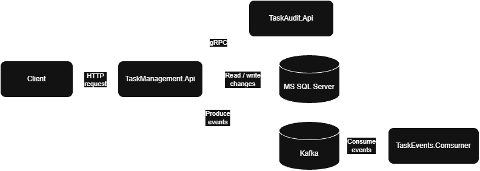

# Задание 1. Task Management Service
Небольшая backend-система для управления пользовательскими задачами. Содержит основной API-сервис, который взаимодействует с одним сервисом синхронно через gRPC, с другим – асинхронно через Kafka

Проект выполнен на `.NET 8`, состоит из нескольких сервисов, которые оркестрируются через Docker Compose

## Технологический стек
- .NET 8
- ASP.NET Core Minimal API
- Entity Framework Core 9
- MS SQL Server 2019
- gRPC
- Apache Kafka
- xUnit
- Docker, Docker Compose

## Архитектура
Решение содержит нескольких сервисов:


- `TaskManagement.Api`: основной REST API для работы с задачами
- `TaskAudit.Api`: gRPC-сервис для получения и логирования событий об изменений задач
- `TaskEvents.Consumer`: Kafka consumer для обработки опубликованных событий
- `TaskManagement.Contracts`: общие межсервисные контракты

Пайплайн изменения задачи состоит из
1. Сохранения изменений в БД
2. Публикации события в `TaskAudit.Api` через gRPC
3. Публикации события в Kafka

## Модель данных
Сущность `Task`

| Поле          | Тип SQL Server     | Обязательное | Ограничения                  | Описание                   |
| ------------- | ------------------ | ------------ | ---------------------------- | -------------------------- |
| `Id`          | `uniqueidentifier` | Да           | Первичный ключ               | Идентификатор задачи       |
| `Title`       | `nvarchar(200)`    | Да           | До 200 символов              | Название                   |
| `Description` | `nvarchar(2000)`   | Нет          | До 2000 символов             | Описание                   |
| `Status`      | `int`              | Да           | `CK_Tasks_Status`: от 0 до 2 | Статус задачи              |
| `CreatedAt`   | `datetimeoffset`   | Да           | -                            | Время создания             |
| `UpdatedAt`   | `datetimeoffset`   | Да           | -                            | Время последнего изменения |

Статус хранится в БД как числовое значение:
```text
0 – New
1 – InProgress
2 – Completed
```

## Развёртывание
Все сервисы запускаются через одну конфигурацию Docker Compose

Используемые контейнеры:
- `task-api`
- `task-audit`
- `task-event-consumer`
- `sqlserver`
- `kafka`
- `kafka-init` (необходим для инициализации топика при первом старте kafka)

### Запуск
Перез запуском необходимо создать `.env` на основе примера `.env.example` и указать пароль SQL Server

Проект запускается одной командой
```bash
docker compose up --build -d
```
После будет доступен на порту `8080`

## Принятые архитектурные решения
Проект намеренно сделан простым, чтобы его можно было легче читать :D

Основные решения:
- Модель данных строится на подходе Code-first с использованием миграций для БД
- Minimal API вместо контроллеров на ASP.NET Core MVC
- EF Core `DbContext` используется напрямую без промежуточных слоёв
- Kafka producer и gRPC клиент скрыты за отдельными интерфейсами и используются через DI
- Любое чтение данных без намерения редактирования выполняется через `AsNoTracking`
- DTO отделены от модели EF Core
- TaskService (бизнес-логика) покрыт unit тестами

## Возможные улучшения
Для production сценария проект можно расширить:
- Outbox паттерн для гарантированной публикации после изменения в БД
- политика retry для gRPC и Kafka
- идемпотентный Kafka consumer (можно реализовать через кэш Redis)
- централизованное логирование в какой-нибудь ClickHouse (или в таблицу в MS SQL с Columnstore index), хотя и Kafka позволяет сделать Event Sourcing
- health checks для всех разработанных сервисов
- интеграционные тесты с помощью Testcontainers

Не стал заниматься реализацией таких архитектурных решений, так как выполнение тестового задания могло растянуться до недели

# Задание 2. Табличная функция для получения платежей клиентов
## Ход решения
Задачу можно разбить на две основные части:
- генерация дат
- присоединение и агрегация платежей клиента

### Генератор
Здесь возникает проблема, что в MSSQL 2019 нет встроенного генератора (в версии 2022 года появилась функция `GENERATE_SERIES`). Самым простым решением было бы использовать CTE с рекурсией, но табличная функция не поддерживает изменение максимальной глубины рекурсии, а 100 итераций было бы недостаточно даже для одного года

Я решил сделать генерацию последовательностей без использования лишних ресурсов СУБД через таблицу `sys.all_objects`

После чистого старта SQL Server 2019 в docker удалось достать из `sys.all_object` **2430 строк**. Этого будет достаточно для генерации дней в промежутке 6.5 лет. Можно пойти дальше, сделав `CROSS JOIN` таблицы саму на себя. Тогда можно генерировать даты на 16 тысяч лет, уже звучит с хорошим запасом

Но для production сценария я бы выделил какую-нибудь отдельную таблицу-календарь

Получился такой алгоритм:
- вычисляекм разницу в количестве дней между датами через `DATEDIFF(DAY, ..., ...)`,
- нумеруем строки из соединённой саму на себя `sys.all_objects` через `ROW_NUMBER` (чтобы получилась последовательность 0, 1, 2...)
- прибавляем к начальной дате последовательность, чтобы получилась последовательность дней в количестве разницы между конечной и начальной датой

Также я решил добавить небольшую валидацию, чтобы вылетало исключение, если перепутать даты местами (конечная дата меньше начальной)

Получился вот такой генератор дат

```sql
DECLARE @Sd DATE = '2022-01-03';
DECLARE @Ed DATE = '2024-01-03';

SELECT DATEADD(DAY, n.DayNumber, @Sd) AS Dt
FROM (
	SELECT TOP (
		CASE WHEN @Ed >= @Sd 
			THEN DATEDIFF(DAY, @Sd, @Ed) + 1
			ELSE 0
		END
	)
	ROW_NUMBER() OVER(ORDER BY (SELECT NULL)) - 1 AS DayNumber
	FROM sys.all_objects a
	CROSS JOIN sys.all_objects b
) n
```
Этот запрос я обернул в CTE Dates

### Присоединение и агрегация платежей
Далее к последовательности дат через `LEFT JOIN` прикручиваем суммы клиента и группируем по дням. Если в правой части не окажется дня с платежом, то через `ISNULL` выведется 0

Я решил реализовать фильтрацию для клиента внутри `JOIN`, чтобы не пришлось делать подзапрос

```sql
SELECT d.Dt, ISNULL(SUM(p.Amount), 0) AS Amount
FROM Dates d
LEFT JOIN dbo.ClientPayments p
    ON p.Client = @ClientId
    AND p.Dt >= d.Dt
    AND p.Dt < DATEADD(DAY, 1, d.Dt)
GROUP BY d.Dt
```
Почему я сделал `JOIN` по диапазону дат, а не через `CAST`? Если у таблицы появится индекс на дату, придётся переписывать под него запрос, так как `CAST` не даст оптимизатору использовать индекс

Функция расположена в файле `GetClientPaymentsFunc.sql`, инициализация БД и тест кейсы функции расположены в `Task2InitAndTest.sql`
